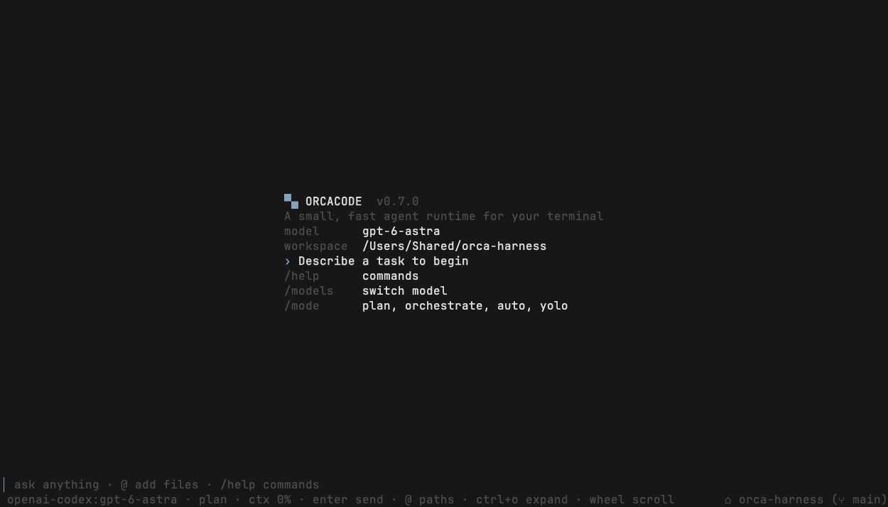
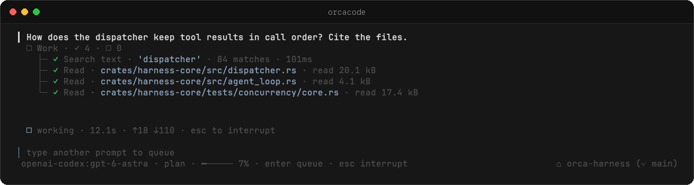
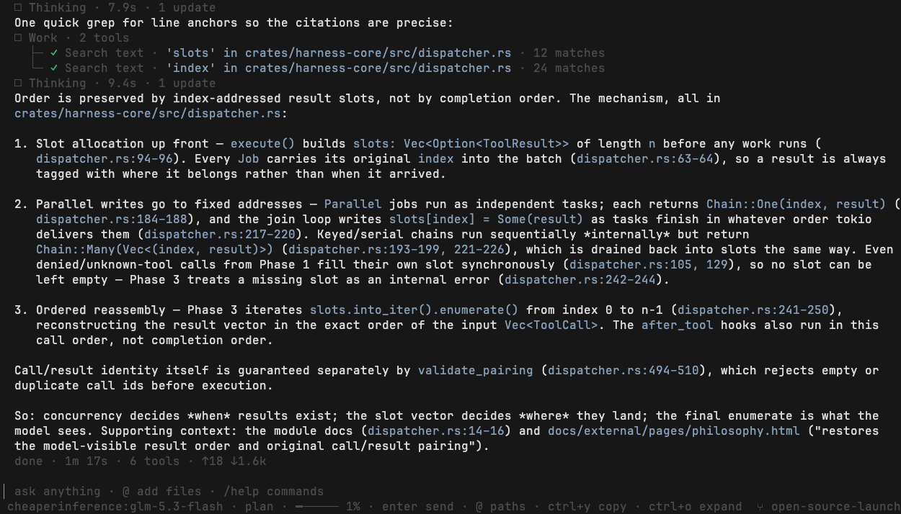

<div align="center">

# Orcacode

**A small, fast coding agent for your terminal, built on an embeddable Rust agent harness.**

One static binary (6.5 MB on macOS). One process. Any model.

[](LICENSE)
[](https://github.com/okikorg/orca-harness/releases)
[](https://orcapods.ai/orcacode/docs/#start)
[](rust-toolchain.toml)

[Install](#install) · [Quick start](#quick-start) · [Docs](https://orcapods.ai/orcacode/docs/#start) · [Embed the harness](#embed-the-harness) · [Contributing](#contributing)

</div>

## What it is

<div align="center">

<table>
  <tr>
    <td width="50%"></td>
    <td width="50%"></td>
  </tr>
  <tr>
    <td align="center">Start in any repo, on any provider</td>
    <td align="center">Tool calls fan out in parallel and group per turn</td>
  </tr>
  <tr>
    <td colspan="2"></td>
  </tr>
  <tr>
    <td colspan="2" align="center">Answers cite the files they read</td>
  </tr>
</table>

</div>

Orcacode is a terminal coding agent. It reads your repo, runs commands, edits
files, and delegates work to parallel subagents, and it asks before any of
that touches your machine. You can sign in with ChatGPT, use an API key, or
point it at a local model.

Underneath is **Orca Harness**, a minimal agent execution kernel. The loop is
small and fast: it fans out 100 parallel tool calls in well under a
millisecond. Everything else (memory, MCP, policy, retries, sessions) plugs in
as an extension. Orcacode is one host built on it, and you can build your own
through the Rust SDK.

> **The loop is sacred. Everything around it is extensible.**

## Why Orcacode

- **Tiny and native.** A single static binary with no Node, Python or Bun
  runtime to install. It idles at about 26 MB. See the
  [comparison](#footprint).
- **You approve what runs.** Gated tools ask first. Plan mode is read-only.
  Orchestrate mode delegates. Auto mode reviews only the risky calls. Yolo
  mode is loud about being yolo.
- **Parallel by design.** Subagents run in the background on their own
  models and providers. Sidekicks keep their context across follow-up tasks.
  Workflows run staged fan-out.
- **Bring any model.** Local OpenAI-compatible servers (Ollama by default),
  OpenAI, a ChatGPT subscription through OpenAI Codex, native Anthropic,
  OpenRouter, Vercel AI Gateway and CheaperInference.
- **Extensible without forking.** MCP servers, Agent Skills, Agent Plugins
  with lifecycle hooks, and project `AGENTS.md` instructions.
- **Scriptable.** Headless `-p` runs and NDJSON event streams for CI.

## Install

macOS and Linux:

```sh
curl -fsSL https://orcapods.ai/orcacode.sh | sh
```

Windows (PowerShell):

```powershell
irm https://orcapods.ai/orcacode.ps1 | iex
```

The installer picks the right build for your OS and architecture, checks its
SHA-256 checksum, and writes one executable to `~/.local/bin`. Every release
is also on the [releases page](https://github.com/okikorg/orca-harness/releases)
with a `SHA256SUMS` file. `orcacode update` upgrades in place.

From source (Rust stable, selected by `rust-toolchain.toml`):

```sh
git clone https://github.com/okikorg/orca-harness
cd orca-harness
cargo run --release -p orcacode
```

## Quick start

Run it from the repository you want it to work in:

```sh
cd your-repo
orcacode --plan        # read-only first session: it explores and proposes, never edits
```

Pick a model:

| Provider             | How                                                                            |
| :------------------- | :----------------------------------------------------------------------------- |
| ChatGPT subscription | run `orcacode`, type `/provider`, pick `openai-codex`, complete the device login |
| OpenAI API           | set `OPENAI_API_KEY`                                                           |
| Anthropic            | set `ANTHROPIC_API_KEY` and pass `--anthropic`                                  |
| OpenRouter           | set `OPENROUTER_API_KEY` and pass `--openrouter`                               |
| Local, no key        | with nothing set it talks to Ollama at `http://localhost:11434/v1`              |

Then ask for something:

```text
› Read the README and explain how this project is structured.
```

Drop `--plan` when you want it to act. Gated calls such as shell, write and
edit pause for you: `y` allows once, `a` allows for the session, `A` saves the
grant for this workspace, and `n` denies. Switch modes live with `/mode`.

Run a prompt unattended, for scripts and CI:

```sh
orcacode -p "Summarize the failing tests"            # transcript to the terminal
orcacode --json -p "Summarize the failing tests"     # one NDJSON event per line
orcacode --bare --no-session -p "List the files here" # read-only tools, no extras
```

The [start guide](https://orcapods.ai/orcacode/docs/#start) goes from here to
a full multi-provider setup in three steps.

## Features

| Area            | What you get                                                                                                                                  | Docs                                                                                                                                         |
| :-------------- | :-------------------------------------------------------------------------------------------------------------------------------------------- | :------------------------------------------------------------------------------------------------------------------------------------------- |
| Modes           | `normal`, `plan` (read-only; plans go to `docs/plan/`), `orchestrate` (delegation-first), `auto` (reviews only risky calls), `yolo`           | [Plan](https://orcapods.ai/orcacode/docs/#plan-mode) · [Orchestrate](https://orcapods.ai/orcacode/docs/#orchestrate-mode) · [Auto](https://orcapods.ai/orcacode/docs/#auto-mode) |
| Subagents       | Background workers routed across `local`, `fast`, `mid` and `frontier` tiers on any provider, with depth, step and timeout budgets             | [Subagents](https://orcapods.ai/orcacode/docs/#subagents)                                                                                     |
| Sidekicks       | Session-long workers that keep their context between follow-up tasks: `/sidekick <task>`, `/sidekick stop`                                   | [Sidekicks](https://orcapods.ai/orcacode/docs/#subagents/sidekicks)                                                                           |
| Tools           | Shell, background processes, persistent Python and Bun REPLs, workspace-rooted file tools with read-before-write, patches, todo list, web      | [Tools](https://orcapods.ai/orcacode/docs/#tools)                                                                                             |
| Sessions        | Recorded per workspace; `--continue`, `--resume`, `/rewind`, `/fork`, `/clear`                                                                | [Sessions](https://orcapods.ai/orcacode/docs/#sessions)                                                                                       |
| Memory          | One local SQLite FTS5 store; the model proposes records, you approve them, and they are recalled automatically                               | [Memory](https://orcapods.ai/orcacode/docs/#memory)                                                                                           |
| MCP             | Stdio servers with lazy tool schemas, so a large catalog costs nothing until a tool is used                                                  | [MCP](https://orcapods.ai/orcacode/docs/#mcp)                                                                                                 |
| Skills & plugins | Agent Skills, Agent Plugins 1.0 packages, and lifecycle hooks that can deny or rewrite tool calls                                           | [Skills](https://orcapods.ai/orcacode/docs/#skills) · [Plugins](https://orcapods.ai/orcacode/docs/#plugins)                                   |
| Headless        | `-p`, `--json` NDJSON events, `--bare`, `--tools` allowlists, `--auto-approve`                                                                | [Headless](https://orcapods.ai/orcacode/docs/#headless)                                                                                       |

## Embed the harness

Orcacode is a reference host. The same kernel is a library.
`orca-harness-sdk` composes models, tools, sessions, memory, skills, MCP,
subagents and workflows behind one dependency. It isn't on crates.io yet, so
depend on it by tag:

```toml
[dependencies]
orca-harness-sdk = { git = "https://github.com/okikorg/orca-harness", tag = "orcacode-v0.7.0" }
tokio = { version = "1", features = ["macros", "rt-multi-thread"] }
```

```rust
use orca_harness_sdk::{Harness, OpenAiModel, ToolPreset};

#[tokio::main]
async fn main() -> Result<(), Box<dyn std::error::Error>> {
    let model = OpenAiModel::new("gpt-4o-mini").api_key(std::env::var("OPENAI_API_KEY")?);

    let harness = Harness::builder().workspace(std::env::current_dir()?).build()?;
    let agent = harness
        .agent(model)
        .system_prompt("Be concise. Inspect before changing files.")
        .tools(ToolPreset::ReadOnly)
        .build()?;

    let session = agent.new_session().ephemeral().open()?;
    let result = session.run("Summarize this workspace").await?;
    println!("{}", result.text);
    Ok(())
}
```

See the [SDK guide](https://orcapods.ai/orcacode/docs/#sdk) and
[`crates/sdk`](crates/sdk) for sessions, custom tools, event streams and
background work.

### Architecture

```text
         AROUND THE HARNESS
┌────────────────────────────────────┐
│  scheduling  sessions  isolation   │
│  persistence  networking  scaling  │
└─────────────────┬──────────────────┘
                  ▼
┌────────────────────────────────────┐
│            ORCA HARNESS            │
│  Agent → Loop → Dispatcher → Tool  │
│                 ↕                  │
│             Extensions             │
└────────────────────────────────────┘
```

The harness owns agent configuration, context, model invocation, the loop,
tool dispatch, concurrent execution, cancellation, deadlines, limits,
call/result pairing, deterministic ordering and the extension lifecycle.
Distributed scheduling, durable storage, isolation and fleet management belong
to whatever system embeds it.

A tool classifies each call, and the dispatcher schedules the batch
accordingly:

| Class                | Behavior                                                                                        |
| :------------------- | :---------------------------------------------------------------------------------------------- |
| `Parallel` (default) | runs alongside anything                                                                         |
| `Serial`             | exclusive; nothing else runs while it does                                                      |
| `Keyed(key)`         | calls sharing a key run in call order, unrelated calls continue (writes key on the target path) |
| `Keys(keys)`         | like `Keyed`, holding several keys at once (a rename touching two paths)                        |

Whatever order tools finish in, the model sees results in the original call
order with call ids paired. `Limits::max_parallel_tools` can cap the width.
The `shell` tool runs on the host by default, or on another machine or
container through an `Executor` (`Executor::ssh("user@host")`,
`Executor::docker_exec("ctr")`).

| Crate                       | Role                                                                            |
| :-------------------------- | :------------------------------------------------------------------------------ |
| `crates/harness-core`       | agent loop, model and tool contracts, dispatcher, limits, test doubles          |
| `crates/model-providers`    | OpenAI-compatible, Codex, Anthropic, OpenRouter, Vercel and CheaperInference adapters |
| `crates/provider-auth`      | provider-neutral credential contracts                                           |
| `crates/tools`              | shell, processes, files, Python and Bun compute, subagents, workflows, todo     |
| `crates/tool-extensions`    | MCP, skills and web integrations                                                |
| `crates/extensions`         | events, policy, memory, compaction, truncation, retry, usage, sessions          |
| `crates/harness-dag`        | validated DAG workflows with dynamic map expansion                              |
| `crates/sdk`                | the high-level Rust facade                                                      |
| `crates/cli`                | `orcacode`, the terminal host                                                   |

[`docs/crate-diagram.md`](docs/crate-diagram.md) has the dependency graph and
[`docs/design.html`](docs/design.html) walks through the design.

## Performance

The number that matters is the overhead between a model emitting tool calls
and those tools doing work. Measured on a 4-core Linux box (release build,
tokio multi-thread) with no-op tools:

| Metric                     |    p50 |    p99 |    target |
| :------------------------- | -----: | -----: | --------: |
| 1 call, dispatch           | 0.4 µs | 0.6 µs |   < 10 µs |
| 10 calls, fan-out          |  60 µs | 121 µs | < ~100 µs |
| 100 calls, fan-out         | 148 µs | 288 µs |    < 1 ms |
| 100 calls, full round-trip | 183 µs | 326 µs |    < 1 ms |

With real tools, 64 `shell` subprocesses of 20 ms each finish in 66 ms instead
of 1.28 s serially. For latency-bound tools the harness turns
`sum(latencies)` into `max(latency)`. Reproduce with
`cargo run --release --example fanout_probe -- 100 300` and
`./benchmarks/kernel/run.sh`; the
[benchmarks page](https://orcapods.ai/orcacode/docs/#benchmarks) has the
method.

Host startup, measured on an Apple M4 Pro (macOS arm64) with the v0.7.0
release build: 100 measured process launches after 10 warmups, using isolated
config, workspace and skill fixtures. Host initialization with session
recording off takes **4.1 ms** (standard deviation 0.3 ms); creating a new
session takes 4.2 ms. `--help` takes 2.7 ms, and the process-launch floor on
that machine is 0.9 ms. The benchmark uses `ORCA_BENCH=1` and exits after
host/agent initialization, before the terminal UI or any model request, so
these are fresh process launches with warmed OS caches — not cache-cold
launches, and not time to the first visible prompt. Reproduce with
`./benchmarks/startup/run.sh`; results are written to
`benchmarks/results/startup/`. CI enforces startup budgets on Linux; macOS
numbers are informational.

### Footprint

All rows were measured on the same Apple Silicon Mac, as the core CLI with no
MCP servers, idle in a live session (RSS summed over the process tree with
`ps` after about 10 s). Orcacode 0.7.0 was measured on 2026-09-24; the other
rows on 2026-08-22 (memory) and 2026-08-27 (binary size). 1 MB = 1,000,000
bytes.

| CLI (version)                                     |                  Binary | Idle RSS | Processes     |
| :------------------------------------------------ | ----------------------: | -------: | :------------ |
| **Orcacode 0.7.0**                                |              **6.5 MB** | **~26 MB** | **1**       |
| Grok Build 1.0.5                                  |                134.3 MB |   ~90 MB | 1             |
| `pi` 0.84.2                                       |          131 MB install |  ~211 MB | 1 + node      |
| Codex 0.149.0-alpha.4.1 (bundled with ChatGPT)    | 220.5 MB + 57.2 MB host |  ~340 MB | up to 3       |
| `prime-agent` 0.7.4                               |          265 MB install |  ~400 MB | 1 + node + py |
| `omp` 17.4.2                                      |      233 MB + 63 MB bun |  ~406 MB | 1 + bun       |
| Claude Code 2.1.220                               |                256.9 MB |  ~456 MB | 1             |

## Develop

```sh
cargo test --workspace                          # unit and integration tests, no network
cargo clippy --workspace --all-targets
cargo run --example fake_llm                    # end-to-end run with a scripted model
cargo run -p orca-harness-sdk --example host_assembly
cargo bench                                     # dispatch, fan-out and extension overhead
./benchmarks/kernel/run.sh                      # dispatch probes, budget-checked
./benchmarks/startup/run.sh                     # cold start, budget-checked
```

Tests drive the kernel through `testing::ScriptedModel`, a fake LLM that
replays scripted responses. Barrier tests prove real overlap, probes assert
per-key serialization and the parallelism high-water mark, and
cancellation tests prove propagation into in-flight fan-out.

## Contributing

Contributions are welcome: bug reports, docs fixes, new providers, tools and
extensions.

1. Open an [issue](https://github.com/okikorg/orca-harness/issues) to report a
   bug or discuss a change before you build it.
2. Fork, branch, and keep the change focused. Match the surrounding code and
   add tests for behavior you change.
3. Run `cargo test --workspace`, `cargo clippy --workspace --all-targets` and
   `cargo fmt --all` before opening a pull request.
4. AI tools and agents are fine for most changes. Changes to
   `crates/harness-core` need human review. See
   [CONTRIBUTING.md](CONTRIBUTING.md#using-ai-tools-and-agents).

By contributing you agree that your contributions are licensed under the
Apache License 2.0.

## Get involved

- **Try it:** `curl -fsSL https://orcapods.ai/orcacode.sh | sh`, then `orcacode --plan` in any repo.
- **Star the repo** if Orcacode is useful to you. It helps other people find it.
- **Read the [field manual](https://orcapods.ai/orcacode/docs/#start)** for every mode, tool and command.
- **Tell us what broke** or what you want next in [issues](https://github.com/okikorg/orca-harness/issues).

## License

Orcacode and Orca Harness are licensed under the
[Apache License, Version 2.0](LICENSE). Copyright 2026 Okik Org. See
[`NOTICE`](NOTICE).
