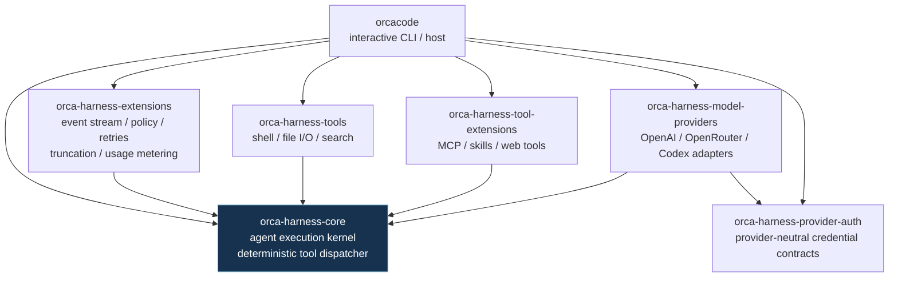

# Orca Harness crate diagram

This diagram shows the workspace's **runtime internal crate dependencies**. External crates from crates.io are omitted. Development-only dependencies are listed below because they do not participate in the shipped dependency graph.

## Dependency shape

- `orca-harness-core` and `orca-harness-provider-auth` are independent foundation crates with no workspace-crate dependencies.
- `orca-harness-extensions`, the baseline tools, and optional tool-extensions depend directly on the core.
- `orca-harness-model-providers` depends on the core execution contracts and the provider-neutral authentication boundary.
- Provider modules share protocol implementations internally; OpenRouter reuses the OpenAI-compatible adapter.
- `orcacode` is the composition root: it wires the kernel, authentication, extensions, tools, model adapters, and terminal UI together.

## Development-only dependencies

The following internal edges are used only by tests/examples and are intentionally not shown above:

- `orca-harness-tools` → `orca-harness-extensions`
- `orca-harness-extensions` → `orca-harness-model-providers`
- `orca-harness-extensions` → `orca-harness-tools`

The kernel fan-out measurements are recorded in [`benchmarks/results/kernel`](../benchmarks/results/kernel/).
